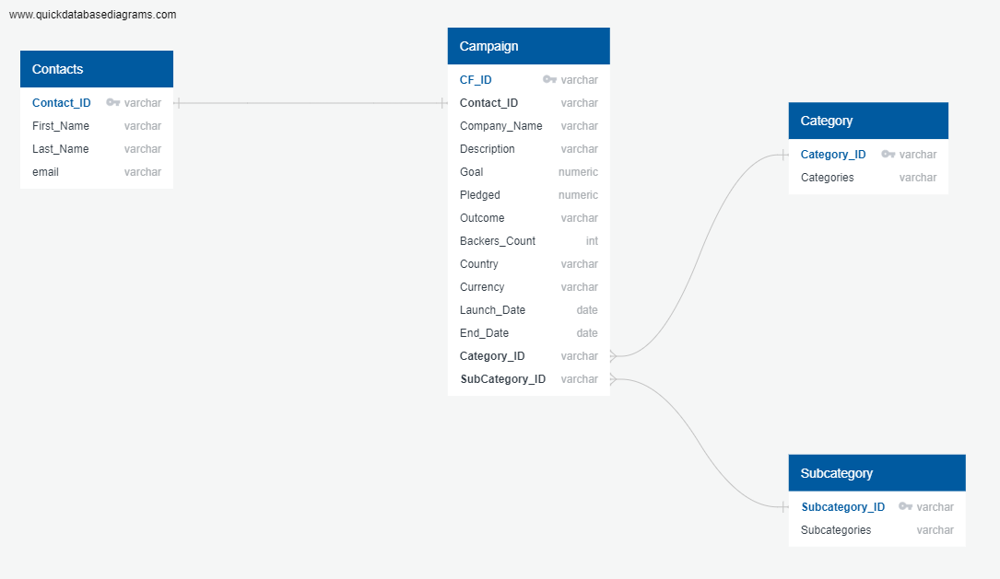

# Crowdfunding_Alaysis

## Website: 
[website](https://github.com/mattcat1221/Crowdfunding_ETL/tree/main)

## Description
#### Crowdfunding Analysis
- Create the Category and Subcategory DataFrames. 
- Create the Campaign DataFrame. 
- Create the Crowdfunding Database
- Create the Contacts DataFrame. 
#### Contacts Analysis
- Create the Contacts Dataframe using Regrex.
 
## Table of Contents
- [Installation](#installation)
- [Usage](#usage)
- [Credits](#credits)
- [License](#license)
- [Features](#features)
- [Tests](#tests)
- [Contact](#contact)

## Installation
pandas, python, Postgre SQL 

## Usage
Educational

## Credits
Casey Matthews, 
Eric Croston

## License
MIT

## Features
dataframes, data tables, schemas

## Tests
Run in conda evironment 

## Contact
If there are any questions of concerns, I can be reached at:
##### [github: mattcat1221](https://github.com/mattcat1221)
##### [email: caseyvmatthews@gmail.com](mailto:caseyvmatthews@gmail.com)
